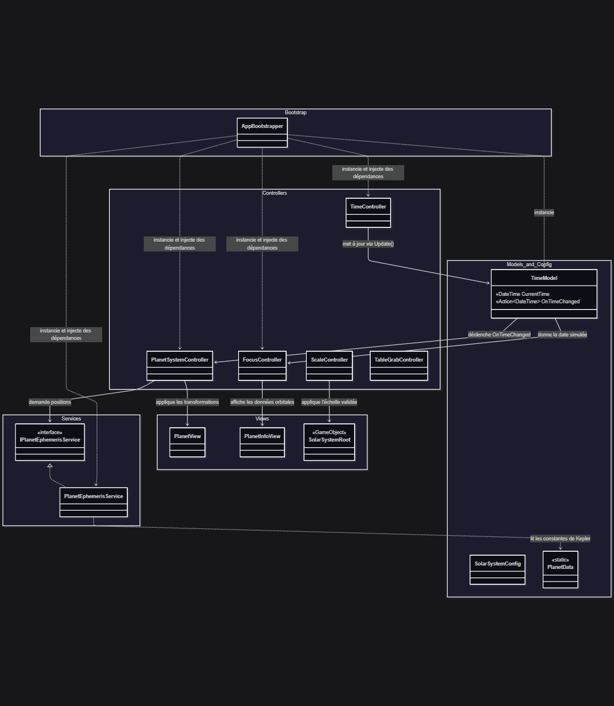
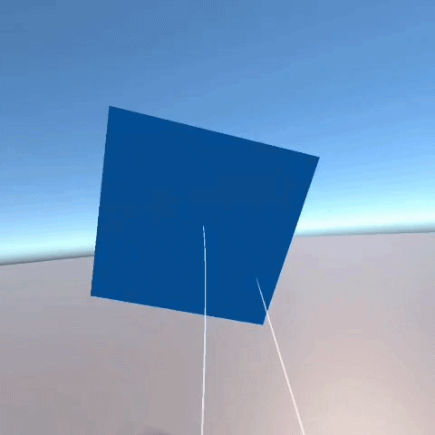
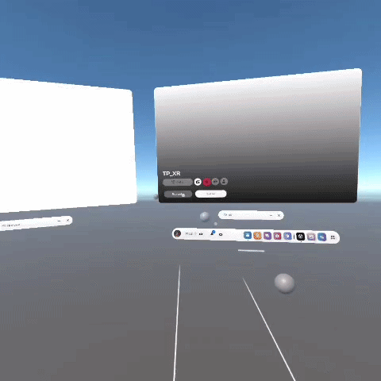
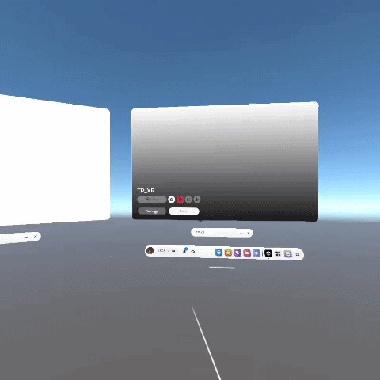

# Compte rendu de projet : Solar System VR Workbench
## MAMOU Antoine

## 1. Lien GitHub du projet

https://github.com/AntoineMamou/XR_engineering_debug

### Tags

- v1.0-boot : Initialisation de la scène VR et de l'interaction de base.

- v1.1-architecture : Mise en place des couches (Modèles, Services, Contrôleurs, Vues) et du Bootstrapper.

- v1.2-events : Implémentation du flux événementiel lié au temps.

- v1.3-vr-interactions : Ajout du Grab, du Scale et du Focus VR.
(J'ai rencontré quelques problèmes au niveau de l'interaction avec l'ui notamment les interactions avec le slider qui n'ont pas pu être corrigés actuellement)

- v1.4-ui-debug : pas implémenté

## 2. Architecture 

### Principes Architecturaux (Modèle-Service-Contrôleur-Vue)
L'application repose sur une séparation claire des responsabilités pour garantir que chaque script n'ait qu'un seul rôle défini.

- Les Modèles (ex: TimeModel) contiennent l'état pur de la simulation, comme la date actuelle ou l'état de lecture. Ils sont totalement indépendants du moteur Unity.

- Les Services (ex: PlanetEphemerisService) isolent les algorithmes complexes, ici les calculs mathématiques des positions orbitales issus des données astronomiques.

- Les Contrôleurs (ex: PlanetSystemController, FocusController) agissent comme des chefs d'orchestre. Ils écoutent les événements du modèle ou les interactions de l'utilisateur, et coordonnent les mises à jour.

- Les Vues (ex: PlanetView, PlanetInfoView) sont de simples composants Unity qui ne s'occupent que de l'affichage visuel et de la mise à jour des Transform dans la scène 3D.

### Initialisation via le Bootstrapper
Pour éviter l'utilisation de méthodes coûteuses en performances (comme FindObjectOfType ou GameObject.Find), l'ensemble du système est initialisé par un point d'entrée unique : l'AppBootstrapper.

Au lancement de la scène, il instancie le modèle temporel et le service d'éphémérides, puis crée le contrôleur principal en lui injectant directement ces éléments ainsi que les références des vues planétaires et le fichier de configuration (SolarSystemConfig). L'arbre des dépendances est ainsi totalement explicite, construit manuellement, et facilement testable.

### Flux de Simulation Événementiel
Le déroulement du temps et le mouvement des planètes sont gérés de manière purement événementielle pour éviter de surcharger inutilement la méthode Update des GameObjects.

Le composant TimeController utilise sa propre méthode Update uniquement pour faire avancer le temps simulé en fonction de la vitesse choisie, et transmet cette nouvelle date au TimeModel. Dès que sa valeur interne change, le TimeModel déclenche un événement (OnTimeChanged). Le PlanetSystemController, qui s'est abonné à cet événement lors de l'initialisation, réagit immédiatement : il interroge le service pour obtenir les nouvelles positions mathématiques, applique les facteurs d'échelle issus de la configuration, et ordonne aux PlanetViews de se déplacer. La vue se contente d'appliquer la position reçue.

### Gestion des Interactions VR
Les interactions de l'utilisateur en réalité virtuelle suivent la même rigueur de découplage, en évitant que les composants physiques XR ne manipulent directement la logique métier.

Pour la manipulation globale, la scène est structurée autour d'un noeud racine (SolarSystemRoot). Le déplacement de l'ensemble du système solaire est géré par l'XR Interaction Toolkit couplé à un contrôleur dédié qui trace les intentions de saisie sans perturber les objets enfants. De même, un ScaleController centralise la mise à l'échelle en validant les valeurs d'entrée avant d'appliquer toute transformation physique.

## 3. Captures d'écran

(Voir le README sur github pour afficher les vidéos)

